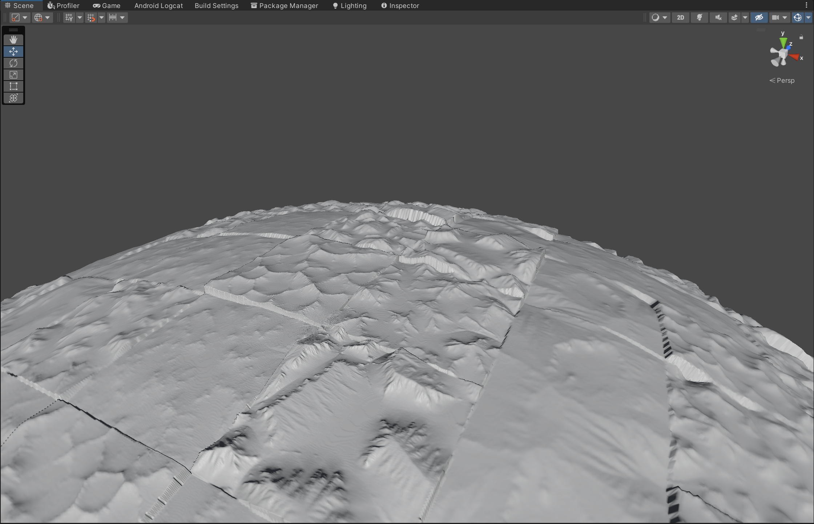
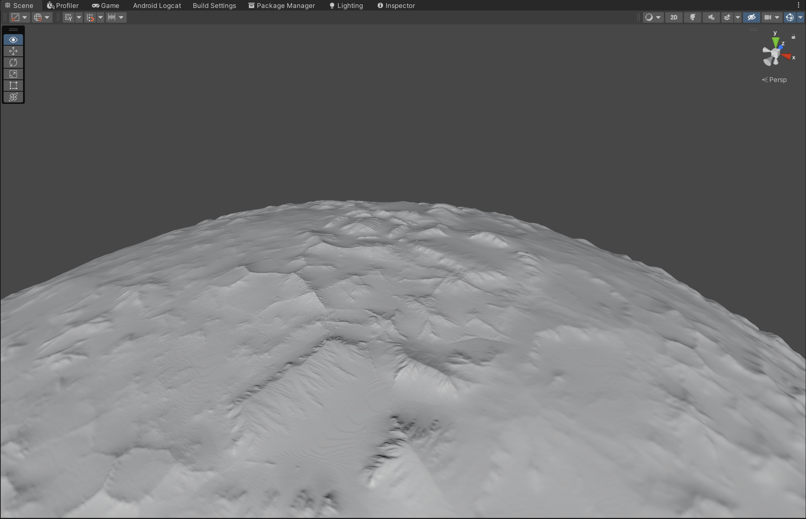
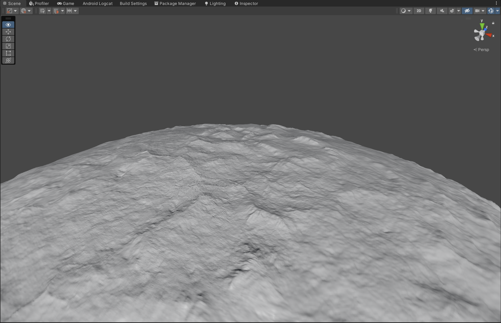

# SgtExtensions

This is an open-source extension to the [SpaceGraphicsToolkit](https://assetstore.unity.com/packages/tools/level-design/space-graphics-toolkit-4160?locale=zh-CN) which introduces some new features.
This project is on a very early stage and most of the support is still WIP.

This repo is made portable and is NOT a complete unity project.

Current published:
- SgteTerrainHeightStampGrid

## Features

### SgteTerrainHeightsStamps

A scriptable object that specifies a group of height maps (called stamps). Each having the below configuration:

- StampMap: the height map for the stamp
- LocalHeightOrigin: the local height origin of this specific stamp, when generating heights, the texture is treated as $[-LocalHeightOrigin, 1 - LocalHeightOrigin]$, which is meant to configured such that when the textures are blended with others, they can be approximately at the same base level. This property can be set to values in range $[0, 1]$. There are buttons for auto inference of local origins regarding the min/average/max height in the inspector.
- LocalDisplacement: the local displacement, With range $[-1, 1]$

**Currently only single-channeled stamps on alpha channel, with unified size are supported**

### SgteTerrainHeightStampGrid

This is an asset that distributes a set of pre-defined height-maps (called height stamp) onto `SgtTerrainPlanet` with respect to a set of grids.
When generating the planet, each vertex point on the terrain is mapped onto a quad of a unit cube. Each quad is divided into $n \times n$ grids, and each grid is pseudo-randomly assigned one height-map, and blended with each other. Such that a trustable detailed terrain can be generated without having to build a huge global heightmap.

#### Properties:

- Area: the `SgtTerrainArea` that the height stamps will emerge
- Seed: the seed for pseudo-random assignment of height stamp of each grid
- Displacement: global displacement control
- HeightOrigin: the global "origin point" of the height value, for example, `HeightOrigin = 0.5f` makes the black region to alter the height with `-0.5f * Displacement`
- GridsPerDim: Number of grids along each x,y dimension on each quad of the unit cube.
- GridSpan: when the localUV is normalized to $[0,1]$, for each grid, how much does each grid overlaps and blends with it's neighbours.
- HeightStamps: The `SgteTerrainHeightStamps` for distributing the height stamps
- HeightStampCount: Specifies the number of height stamps inside `SgteTerrainHeightStamps` to be used. Restricted to be smaller than the actual size of the `SgteTerrainHeightStamps`, higher value leads to lower probability of generating repetitive pattern, but consumes more memory.

#### Demonstration:

- Trustable near terrain from heightmap presets:

- Without grid blending (for demonstrating the grids):

- With grid blending:

- Working with `SgtTerrainHeightmap` to introduce global height and reduces potential repetitiveness:

## TODOs

### SgteTerrainHeightStampGrid

- Extending `SgtTerrainMaterial` to sync with the height stamps?
- Normal-fade of the height stamps with respect to a global height-map, to mimic the terrain gravitational erosion
- Use spherical angular coordinates for mapping grids such that the size of the grids can be evenly distributed
- Can global/local displacement and heightOrigins to be a distribution rather than a constant configuration?
- UV distortion support

### WIP Features

#### SgteTerrainHeightStampRandom

Like `SgteTerrainHeightStampGrid`, but the heightstamps are randomly distributed instead of restricted to a grid, will be useful to generate terrain-features like craters. The density is controlled by `SgtTerrainArea`

#### SgteECSTerrainPrefabSpawner

Terrain prefab spawner integrated with [Svelto.ECS](https://github.com/sebas77/Svelto.ECS) to achieve high performance

#### SgteWarpAlongPath

As what the feature name says, the path is defined as a list of `SgtPosition`, with configurable interpolation rules (e.g: Cubic Bezier)